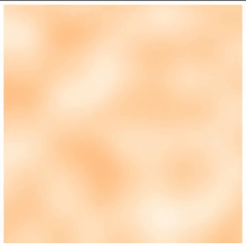

# Perlin Noise (TypeScript implementation)

- 📄 <strong>Perlin Noise</strong> is is a procedural texture primitive, a type of gradient noise
- 🔧 No imported libraries (\*use only Alea algorithm implementation of PRNG\*)
- 🌌 Infinite HTML Canvas visualization 
- 🎨 Output range values and gradient colors customization
- 🔍 Live demo available

### Demonstration

[🔗 Live demo](https://marvelous-pastelito-930c8d.netlify.app/)

